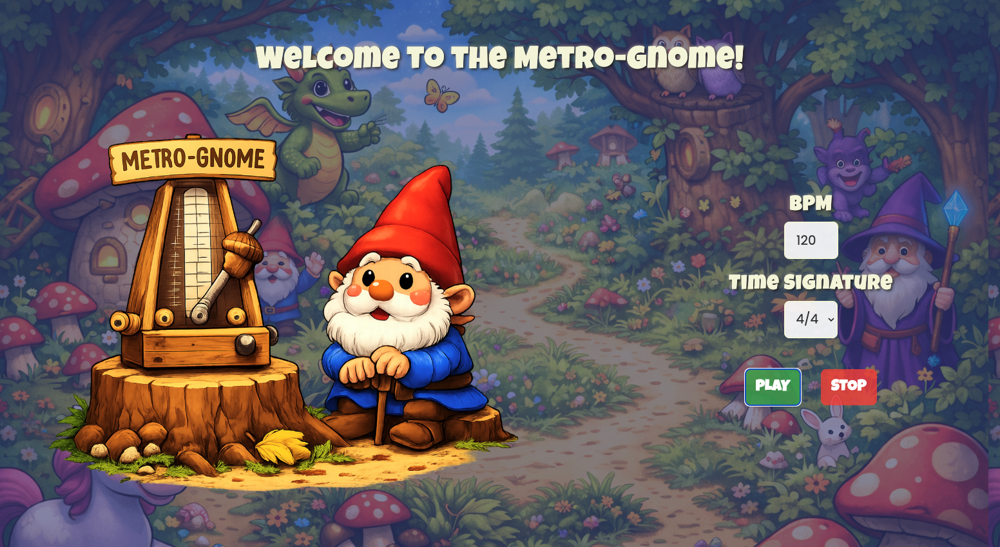
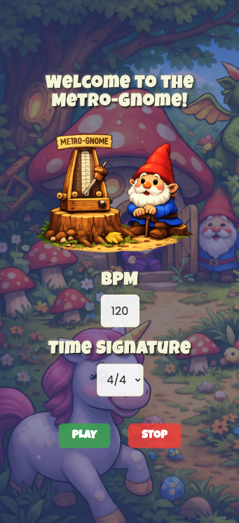
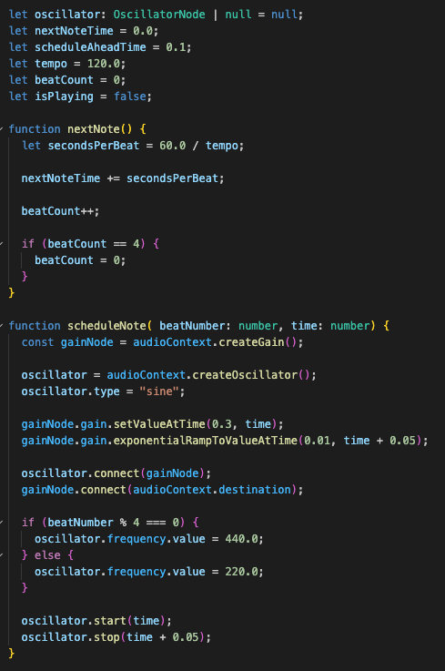
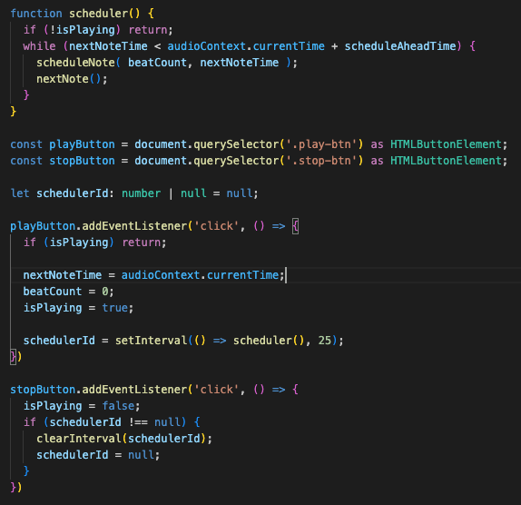
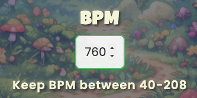

# 🍄 Metro-Gnome 🍄

A whimsical browser-based metronome built with TypeScript and Web Audio API designed for young musicians.




---

## Table of Contents
1. [Prerequisites](#prerequisites)
2. [Project Setup](#project-setup)
3. [Debugging Node Version Conflicts](#debugging-node-version-conflicts)
4. [Design Decisions](#design-decisions)
5. [Testing & Development Process](#testing--development-process)
6. [Building the Metronome Functionality](#building-the-metronome-functionality)
7. [Connecting the UI Controls](#connecting-the-ui-controls)
8. [More Design Decisions](#more-design-decisions)

---

## Prerequisites

Before you begin, ensure you have the following installed:

### **Node.js**
- Download from: https://nodejs.org/
- Verify installation:
```bash
node -v
```

### **NPM**
- Comes with Node.js
- Verify installation:
```bash
npm -v
```

### **Git** (optional, for cloning)
- Download from: https://git-scm.com/
- Verify installation:
```bash
git --version
```

---

## Project Setup

### 1. Clone the Repository

```bash
git clone https://github.com/SeaForeEx/metro-gnome.git
cd metrognome
```

### 2. Install Dependencies
```bash
npm install
```

### 3. Run the Development Server
```bash
npm run dev
```

Open your browser to `http://localhost:5173/`

---

## Debugging Node Version Conflicts

### The Problem
I had conflicting Node.js installations (Homebrew and NVM), causing my terminal to use the wrong version.

### The Solution
I identified which installation was being used with `which node`, disabled NVM in my shell configuration, and verified the correct version was now active.

---

## Design Decisions

### Branding & Theme

Since QuaverEd builds educational music applications for K-8 students, I wanted to create something that would be engaging and fun for young learners while maintaining a professional, musical focus.

<table>
<tr>
<td width="50%">

**The Metro-Gnome Concept**
<br /><br />
I chose "Metro-Gnome" as a playful spin on "metronome" - combining the musical tool with a whimsical garden gnome character. This creates:
- A memorable, kid-friendly brand
- Visual interest that appeals to younger students
- A lighthearted approach to music practice

**Other Concept Considered:**
- **Q-Nome**: Maintaining QuaverEd's "Q" branding while creating a metronome app

The Metro-Gnome won out for its broad appeal, clear visual identity, and alignment with QuaverEd's mission to make music education accessible and enjoyable for elementary students.

### Responsive Design

The app adapts to different screen sizes to ensure usability across devices students and teachers might use:

**Key responsive features:**
- Desktop (already shown): Side-by-side layout with image and controls
- Mobile (to the right): Stacked vertical layout for easier touch interaction

</td>
<td width="50%">



</td>
</tr>
</table>
  
---

## Testing & Development Process

Before implementing the full metronome, I tested basic Web Audio API functionality to understand how audio nodes work.

### First Test: Creating a Simple Beep

I tested creating a single beep sound when the play button was clicked:
```typescript
const audioContext = new AudioContext();

document.querySelector<HTMLDivElement>('#app')!.innerHTML = `
  <div class='container'>
    <button class='control-btn play-btn'>PLAY</button>
  </div>

const playButton = document.querySelector('.play-btn') as HTMLButtonElement;

playButton.addEventListener('click', () => {
  const oscillator = audioContext.createOscillator();
  const gainNode = audioContext.createGain();

  oscillator.frequency.value = 440;
  oscillator.type = "sine";

  const now = audioContext.currentTime;
  gainNode.gain.setValueAtTime(0.3, now);
  gainNode.gain.exponentialRampToValueAtTime(0.01, now + 0.05);

  oscillator.connect(gainNode);
  gainNode.connect(audioContext.destination);

  oscillator.start(now);
  oscillator.stop(now + 0.05);
});
```

### Breaking It Down

**1. Create the AudioContext**
```typescript
const audioContext = new AudioContext();
```
Set up the AudioContext to access the Web Audio API. This is your audio "workspace" that gives you access to all audio features and maintains an internal clock.

**2. Create the HTML and get the button reference**
```typescript
document.querySelector('#app')!.innerHTML = `...`
const playButton = document.querySelector('.play-btn') as HTMLButtonElement;
```
Created a play button in the HTML, then used querySelector to access it in JavaScript.

**3. Add an event listener to the button**
```typescript
playButton.addEventListener('click', () => {
```
Attached an event listener so the audio code runs every time the user clicks the play button.

**4. Create the audio nodes**
```typescript
const oscillator = audioContext.createOscillator();
const gainNode = audioContext.createGain();
```
Created an oscillator (sound generator) and a gain node (volume controller) from the AudioContext.

**5. Configure the oscillator**
```typescript
oscillator.frequency.value = 440;
oscillator.type = "sine";
```
Set the frequency to 440 Hz (A4 note) and the wave type to sine wave (the basic building block of sound).

**6. Set up the timing reference**
```typescript
const now = audioContext.currentTime;
```
Captured the current time from the audio clock. This tells all subsequent operations when to start. Think of this like SMPTE timecode - it's the precise time reference that keeps all audio events synchronized and sample-accurate.

**7. Create the volume envelope**
```typescript
gainNode.gain.setValueAtTime(0.3, now);
gainNode.gain.exponentialRampToValueAtTime(0.01, now + 0.05);
```
Set the gain to start at 0.3 (30% volume) instantly at `now`, then decay exponentially to 0.01 (1% volume) over 0.05 seconds. This creates a short "click" sound instead of a sustained tone.

**8. Connect the audio routing**
```typescript
oscillator.connect(gainNode);
gainNode.connect(audioContext.destination);
```
Connected the oscillator to the gain node, then connected the gain node to the destination (speakers/headphones). Signal flow: Oscillator → GainNode → Speakers.

**9. Start and stop the sound**
```typescript
oscillator.start(now);
oscillator.stop(now + 0.05);
```
Started the oscillator at `now` and scheduled it to stop 0.05 seconds later, matching the decay time of the volume envelope.

**Result:** A percussive "tick" sound that plays each time the button is clicked - perfect for a metronome!

---

### Second Test: Start/Stop Controls

I tested start/stop functionality to understand oscillator lifecycle management. Key learning: oscillators must be stored in a variable to be stopped later - you can only stop an oscillator you've maintained a reference to.

---

## Building the Metronome Functionality

Once I connected to the Web Audio API and achieved start/stop functionality, I focused on creating a steady beat. I decided to hardcode a 4/4 time signature at 120 BPM before connecting the user inputs to the metronome.

I researched Web Audio API timing and found an authoritative article that not only broke down the issues with creating browser-based metronomes but also provided an elegant solution combining JavaScript intervals and Web Audio API.

Chris Wilson's ["A Tale of Two Clocks"](https://www.html5rocks.com/en/tutorials/audio/scheduling/) explains that while Web Audio API provides precise timing through its audio clock, users cannot directly interact with it for controls. Although users can interact with JavaScript timers (setTimeout, setInterval), these aren't 100% accurate due to other computations happening on the main thread. I implemented this pattern based on Wilson's [GitHub metronome repo](https://github.com/cwilso/metronome), adapting the core scheduling logic for my UI and time signature system.

### The Code

<table>
<tr>
<td width="50%">



</td>
<td width="50%">



</td>
</tr>
</table>

### Breaking It Down

**1. Global Variables**
```typescript
let oscillator: OscillatorNode | null = null;
let nextNoteTime = 0.0;
let scheduleAheadTime = 0.1;
let tempo = 120.0;
let beatCount = 0;
let isPlaying = false;
```

- **oscillator:** Stores reference to the most recently created oscillator. A new oscillator is created for each beat.
- **nextNoteTime:** The time (in seconds on the audio clock) when the next beat should play.
- **scheduleAheadTime:** How far ahead the scheduler looks to check if beats need scheduling (0.1 seconds = 100ms).
- **tempo:** The beats per minute (default 120 BPM).
- **beatCount:** Tracks the current beat number in the measure (0-3 for 4/4 time).
- **isPlaying:** Boolean flag indicating whether the metronome is currently active.

**2. User Clicks Play**
```typescript
let schedulerId: number | null = null;

playButton.addEventListener('click', () => {
  if (isPlaying) return;

  nextNoteTime = audioContext.currentTime;
  beatCount = 0;
  isPlaying = true;

  schedulerId = setInterval(() => scheduler(), 25);
})
```

- **schedulerId:** Stores the interval ID returned by setInterval so we can stop it later with clearInterval.
- **if (isPlaying) return:** Prevents starting multiple schedulers if the play button is clicked repeatedly.
- **Initialization:** Sets nextNoteTime to the current audio time (starts immediately), resets beatCount to 0 (starts from beat 1), and sets isPlaying to true.
- **Start Scheduler:** Calls the scheduler function every 25 milliseconds to check if beats need scheduling.

**3. Scheduler Function**
```typescript
function scheduler() {
  if (!isPlaying) return;
  while (nextNoteTime < audioContext.currentTime + scheduleAheadTime) {
    scheduleNote(beatCount, nextNoteTime);
    nextNote();
  }
}
```

- **if (!isPlaying) return:** Exits immediately if the metronome is not playing.
- **while loop:** Checks if any beats need to be scheduled within the next 100ms (the lookahead window).
- **For each beat:** Calls scheduleNote() to create and schedule the oscillator at the precise time, then nextNote() to calculate when the next beat should occur.

**4. scheduleNote Function**
```typescript
function scheduleNote(beatNumber: number, time: number) {
  const gainNode = audioContext.createGain();
  oscillator = audioContext.createOscillator();
  oscillator.type = "sine";
  
  gainNode.gain.setValueAtTime(0.3, time);
  gainNode.gain.exponentialRampToValueAtTime(0.01, time + 0.05);
  
  oscillator.connect(gainNode);
  gainNode.connect(audioContext.destination);
  
  if (beatNumber % 4 === 0) {
    oscillator.frequency.value = 440.0;
  } else {
    oscillator.frequency.value = 220.0;
  }
  
  oscillator.start(time);
  oscillator.stop(time + 0.05);
}
```

- **Oscillator and GainNode:** Creates the click sound with envelope shaping (similar to the Simple Beep test).
- **if (beatNumber % 4 === 0):** Accents beat 1 of each measure with a higher frequency (440Hz vs 220Hz) so users can count measures.

**5. nextNote Function**
```typescript
function nextNote() {
  let secondsPerBeat = 60.0 / tempo;
  nextNoteTime += secondsPerBeat;
  beatCount++;
  
  if (beatCount == 4) {
    beatCount = 0;
  }
}
```

- **secondsPerBeat:** Calculates the duration of one beat in seconds (60 ÷ 120 BPM = 0.5 seconds per beat).
- **nextNoteTime:** Advances by one beat duration to schedule the next beat at the correct time.
- **beatCount:** Increments by 1 to track position in the measure.
- **if (beatCount == 4):** Resets beatCount to 0 after 4 beats, starting a new measure.

**6. User Clicks Stop**
```typescript
stopButton.addEventListener('click', () => {
  isPlaying = false;
  if (schedulerId !== null) {
    clearInterval(schedulerId);
    schedulerId = null; 
  }
})
```

- **isPlaying = false:** Signals the scheduler to stop scheduling new beats on its next check.
- **clearInterval:** Stops the 25ms interval from calling the scheduler function and resets schedulerId to null for cleanup.

**Note:** Any beats already scheduled within the 100ms lookahead window will still play until they finish. The metronome stops scheduling new beats immediately, but stops completely within ~100ms.

---

## Connecting the UI Controls

Now that I have a steady beat, it's time to connect the BPM and Time Signature input fields for user interaction.

### BPM

#### The HTML
```html
<label for='bpm'>BPM</label>
<input type='number' id='bpm' value='120' min='40' max='208' 
  oninput="this.value = this.value.replace(/[^0-9]/g, '')" />
  <span id='bpm-error' class='error-message'>
    Keep BPM between 40-208
  </span>
```

- **input type='number':** Creates a number input field with up/down arrow controls.
- **value='120':** Sets the default starting tempo to 120 BPM.
- **min='40' max='208':** Limits the arrow buttons to a range of 40-208 BPM. This range covers all practical musical tempos while preventing extremely slow or fast speeds that could cause audio issues or be unusable for K-8 students.
- **oninput validation:** Uses a regular expression to strip any non-digit characters as the user types, preventing negative numbers, letters, and symbols.
- **error message span:** Hidden by default, displays "Keep BPM between 40-208" when user types a value outside the valid range.




#### The TypeScript
```typescript
let tempo = 120.0;
const bpmInput = document.getElementById('bpm') as HTMLInputElement;
const bpmError = document.getElementById('bpm-error') as HTMLElement;

bpmInput.addEventListener('input', () => {
  const value = parseFloat(bpmInput.value);
  if (value >= 40 && value <= 208) {
    tempo = value;
    bpmError.style.display = 'none';
  } else {
    bpmError.style.display = 'block';
  }
});

bpmInput.addEventListener('blur', () => {
  bpmInput.value = tempo.toString();
  bpmError.style.display = 'none';
});

function nextNote() {
  let secondsPerBeat = 60.0 / tempo;
  // ...
}
```

- **tempo:** Initialized to 120 as the default starting tempo, updated when user changes the BPM input.
- **bpmInput:** References the BPM input field in the DOM.
- **bpmError:** References the error message element (hidden by default).
- **input event listener:** Validates the typed BPM value. If between 40-208, updates tempo and hides the error. If outside this range, shows the error message without updating tempo.
- **blur event listener:** When the user leaves the input field, resets the display to match the current tempo and hides any error message.
- **nextNote():** The tempo variable is used here to calculate secondsPerBeat, which determines the interval between metronome clicks.

### Time Signature

#### The HTML
```html
<label for='time-signature'>Time Signature</label>
<select id='time-signature'>
  <option value='4'>4/4</option>
  <option value='3'>3/4</option>
  <option value='6'>6/8</option>
</select>
```

- **select element:** Dropdown menu for selecting time signature, with `id='time-signature'` to connect to JavaScript.
- **option values:** Provides four common time signatures (4/4, 3/4, 6/8). The value represents the number of beats per measure.

#### The TypeScript
```typescript
let timeSignature = 4;
const timeSignatureInput = document.getElementById('time-signature') as HTMLSelectElement;

timeSignatureInput?.addEventListener('input', () => {
  timeSignature = parseFloat(timeSignatureInput.value);
})

function nextNote() {
  let secondsPerBeat = 60.0 / tempo;
  
  // 6/8 time plays eighth notes (twice as fast)
  if (timeSignature === 6) {
    secondsPerBeat = secondsPerBeat / 2;
  }
  // ...
}
```

- **timeSignature:** Initialized to 4 (4/4 time signature), updated when user changes the time signature dropdown.
- **timeSignatureInput:** References the time signature select menu in the DOM.
- **input event listener:** Updates the timeSignature variable when user selects a different option from the dropdown.
- **nextNote() logic:** If 6/8 time is selected, divides the beat duration by 2 to play eighth notes instead of quarter notes, making the clicks twice as fast to match standard metronome behavior for compound time signatures.

---

## More Design Decisions

### Adding Thematic UI Elements

<table>
<tr>
  <td width="50%">
    After completing the initial implementation, I continued refining the UI to better align with the whimsical forest theme and K-8 target audience.
    <br /><br />
    <strong>BPM Slider with Acorn Handle:</strong><br />
    I replaced the number input with a slider featuring a custom acorn thumb. This change provides:
    <ul>
      <li><strong>More intuitive interaction</strong> for young users who may struggle with precise number typing</li>
      <li><strong>Immediate visual feedback</strong> of the tempo range</li>
      <li><strong>Tactile experimentation</strong> encouraging students to explore different tempos by feel</li>
      <li><strong>Thematic consistency</strong> with the forest/gnome aesthetic</li>
    </ul>
    <br />
    <strong>Wooden Play/Stop Buttons:</strong><br />
    I created custom wooden-textured buttons to replace the standard controls, reinforcing the forest theme and making the interface more engaging for young musicians.
    <br /><br />
    These iterations demonstrate that even after core functionality is working, reconsidering UX and visual design through the lens of the end user can lead to meaningful improvements in both usability and delight.
  </td>
  <td width="50%">
    
  </td>
</tr>
</table>

---
